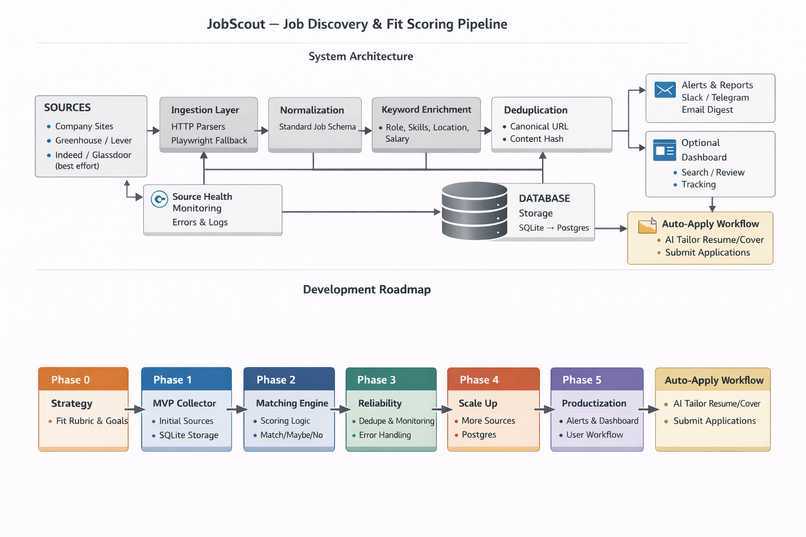

# JobScout: Job Discovery & Fit Scoring Pipeline

JobScout is a modular job-intelligence pipeline that discovers new job postings early across multiple sources, normalizes the data into a consistent schema, scores each posting against a personal “fit rubric,” deduplicates results, and saves high-signal matches for review and fast action.

> Scope note: This repo focuses on **discovering + ranking + saving** jobs. “Auto-apply” workflows are intentionally out of scope for the MVP and should remain human-in-the-loop due to site variability and platform restrictions.

---

## Key Capabilities

- **Multi-source ingestion** (company career pages first; aggregators optional)
- **Normalized job schema** across sources
- **Deduplication** (canonical URL + content hash)
- **Fit scoring** via a configurable rubric (must-haves, nice-to-haves, red flags)
- **Storage** (SQLite for local dev; Postgres-ready)
- **Notifications** (optional: email / Slack / Discord / Telegram)
- **Observability** (logging + basic source health)

---

## Architecture
Ingestion (scrapers) → Normalization → Scoring → Dedupe → Storage → Alerts/Dashboard

### Core Principles

- Prefer **HTTP parsing** first; use **browser automation** only when necessary.
- Keep each job source as a **connector module** with clear inputs/outputs.
- Store both **structured data** and (optionally) **raw snapshots** for debugging.

---

## Tech Stack (MVP)

- **Python 3.11+**
- Scraping: `httpx`, `selectolax` (or `bs4`)
- Optional JS sites: `playwright`
- API / CLI: `fastapi`, `typer`
- Storage: `sqlite` (default), Postgres-ready models
- Migrations: `alembic` 

# Fit Scoring (Rubric)

## Scoring is driven by a rubric you can tune over time.

### Inputs

- Target role keywords (e.g., frontend, react, next.js)

- Must-haves (e.g., remote, vancouver, junior/mid)

- Nice-to-haves (e.g., typescript, graphql, postgres)

- Red flags (e.g., unpaid, 10+ years, on-site only)

### Outputs

- decision: match | maybe | no

- score: numeric

- tags: extracted skill and constraint signals

## Contributing

PRs welcome. Please keep connectors isolated per source and add a small smoke test for each new parser.

# License

This project is licensed under the MIT License — see the LICENSE file.

## Project Flow
